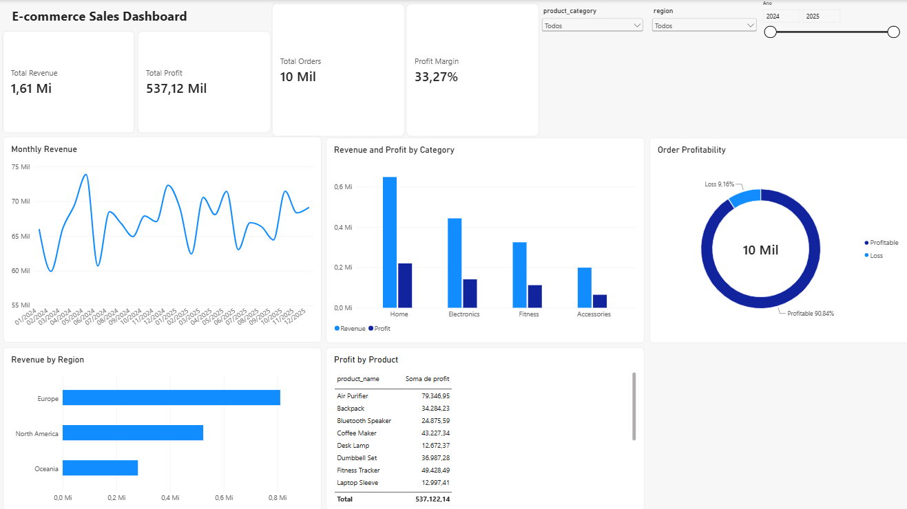
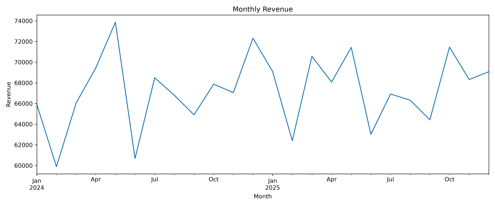
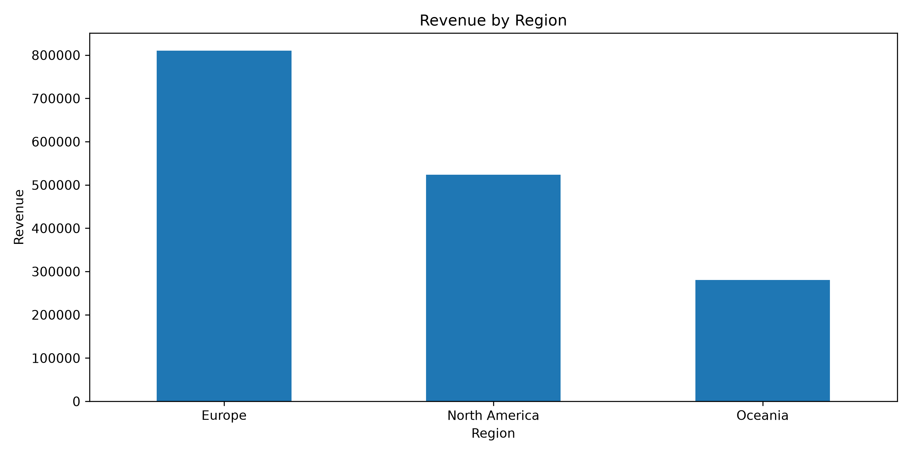
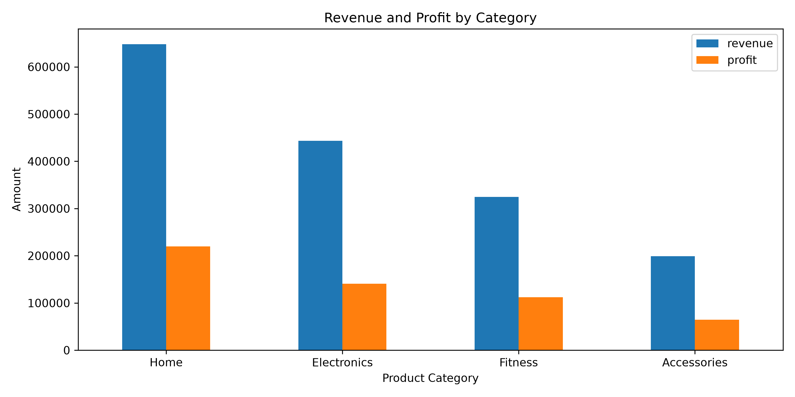

# E-commerce Sales Analysis

## 📊 Project Overview

This project presents an end-to-end analysis of a synthetic e-commerce dataset covering the period from January 2024 to December 2025.

The project combines **Python, Pandas, SQL, SQLite, data visualization, and Power BI** to clean and validate the data, explore business performance, identify actionable insights, and build an interactive dashboard for decision-making.

> **Note:** This is a portfolio project using a synthetic dataset created for analytical purposes. It does not represent a real company or real customer data.

---

## 📊 Power BI Dashboard



The interactive Power BI dashboard provides a consolidated view of business performance, including:

- Total Revenue
- Total Profit
- Total Orders
- Profit Margin
- Monthly Revenue Trend
- Revenue and Profit by Category
- Revenue by Region
- Profit by Product
- Order Profitability
- Interactive filters for Product Category, Region, and Year

The Power BI file is available at:

`powerbi/ecommerce_sales_dashboard.pbix`

---

## 🎯 Business Questions

The analysis focuses on the following questions:

- How much revenue and profit did the business generate?
- Which product categories generate the most revenue and profit?
- Which categories have the highest profit margins?
- Which regions generate the most revenue?
- Which products contribute most to profit?
- How many orders are unprofitable?
- Is there a relationship between discounts and unprofitable orders?
- How does revenue change over time?

---

## 🛠️ Tools & Technologies

- **Python 3.13**
- **Pandas** — data cleaning and analysis
- **Matplotlib** — exploratory visualizations
- **Jupyter Notebook** — exploratory data analysis
- **SQL** — business analysis and aggregation
- **SQLite** — relational database
- **Power BI** — interactive dashboard and data visualization
- **DAX** — calculated measures and dashboard metrics
- **Git & GitHub** — version control and project documentation

---

## 🧹 Data Cleaning

The raw dataset originally contained:

- 10,025 records
- 18 columns

The following data quality issues were identified and addressed:

- Duplicate records
- Missing customer names
- Missing payment methods
- Inconsistent product categories
- Invalid discount values
- Date fields stored as text

After cleaning and validation, the final dataset contains:

- **10,000 records**
- **18 columns**
- No duplicate records
- No invalid quantities
- No invalid unit prices
- No invalid unit costs
- No invalid revenue values

Detailed documentation is available in [`reports/data_quality_report.md`](reports/data_quality_report.md).

---

## 📈 Key Performance Indicators

| KPI | Value |
|---|---:|
| Total Revenue | **$1,614,512.83** |
| Total Profit | **$537,122.14** |
| Profit Margin | **33.27%** |
| Total Orders | **10,000** |
| Average Order Value | **$161.45** |

---

## 🔎 Key Business Insights

### 🏠 Home is the largest revenue category

Home generated **$648,072.15** in revenue and **$219,897.66** in profit, making it the strongest category in terms of total financial contribution.

### 💪 Fitness has the highest profit margin

Fitness achieved the highest category-level profit margin at **34.51%**.

### 🌍 Europe is the largest market

Europe generated **$810,434.86** in revenue and **$269,102.83** in profit across **5,047 orders**, making it the largest regional market.

### 🌊 Oceania has the highest regional margin

Oceania achieved a **33.81%** profit margin, slightly above Europe and North America.

### ⚠️ 9.16% of orders are unprofitable

Out of 10,000 orders:

- **9,084 orders (90.84%)** were profitable.
- **916 orders (9.16%)** generated a loss.

### 🏷️ Higher discounts are associated with unprofitable orders

Orders with negative profit had an average discount of **10.28%**, compared with **6.87%** for profitable orders.

This suggests that higher discount levels may contribute to reduced order-level profitability and should be monitored as part of the pricing strategy.

More detailed findings are available in [`reports/business_insights.md`](reports/business_insights.md).

---

## 🗄️ SQL Analysis

The cleaned dataset was loaded into a SQLite database containing **10,000 orders**.

SQL queries were used to validate and analyze:

- Total revenue and profit
- Order volume
- Profit margins
- Revenue and profit by product category
- Regional performance
- Product-level profitability
- Profitable vs. loss-making orders
- Discount behavior
- Monthly sales performance

This demonstrates the use of SQL to answer practical business questions independently from the Python analysis.

---

## 📊 Exploratory Visualizations

### Monthly Revenue



### Revenue by Region



### Revenue and Profit by Category



---

## 📁 Project Structure

```text
ecommerce-sales-analysis/
│
├── data/
│   ├── raw/
│   │   └── ecommerce_orders_raw.csv
│   │
│   └── processed/
│       └── ecommerce_orders_clean.csv
│
├── images/
│   └── dashboard.png
│
├── notebooks/
│   └── 01_exploratory_data_analysis.ipynb
│
├── powerbi/
│   └── ecommerce_sales_dashboard.pbix
│
├── reports/
│   ├── data_quality_report.md
│   └── business_insights.md
│
├── sql/
│
├── src/
│   └── generate_dataset.py
│
├── visualizations/
│   ├── monthly_revenue.png
│   ├── revenue_by_region.png
│   └── category_revenue_profit.png
│
├── ecommerce_sales_analysis.db
├── .gitignore
└── README.md
```

---

## 🚀 How to Run the Project

### 1. Clone the repository

```bash
git clone https://github.com/Adriel-dC/ecommerce-sales-analysis.git
cd ecommerce-sales-analysis
```

### 2. Create a virtual environment

```bash
py -3.13 -m venv .venv
```

### 3. Activate the environment

Windows PowerShell:

```powershell
.venv\Scripts\Activate.ps1
```

### 4. Install dependencies

```bash
pip install pandas matplotlib jupyter
```

### 5. Launch Jupyter Notebook

```bash
jupyter notebook
```

Then open:

```text
notebooks/01_exploratory_data_analysis.ipynb
```

### 6. Explore the Power BI Dashboard

Open:

```text
powerbi/ecommerce_sales_dashboard.pbix
```

using Power BI Desktop.

---

## 💼 Skills Demonstrated

This project demonstrates practical Data Analyst skills in:

- Data Cleaning
- Data Validation
- Exploratory Data Analysis (EDA)
- SQL Querying
- Business Analysis
- KPI Development
- Data Visualization
- Dashboard Design
- Power BI
- DAX
- Python & Pandas
- SQLite
- Git & GitHub
- Communicating Analytical Findings

---

## 👤 About This Project

This project was developed as part of a **Data Analyst portfolio** to demonstrate an end-to-end analytical workflow, from raw data preparation and SQL analysis to business insights and an interactive Power BI dashboard.